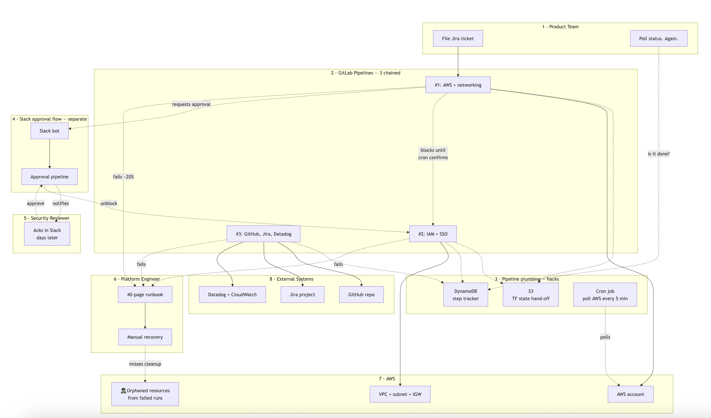
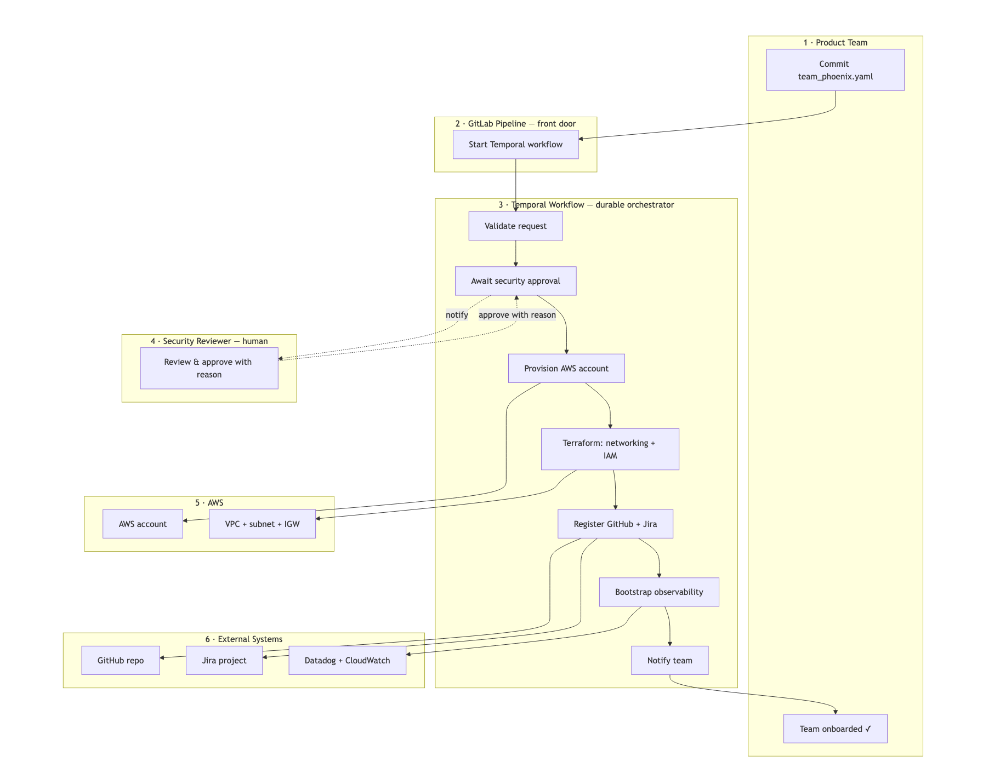
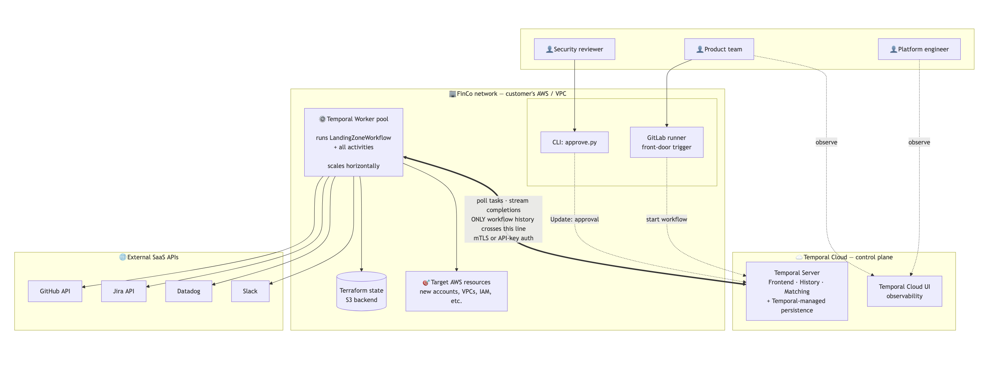

# Temporal Landing Zone Demo

A working Temporal workflow that orchestrates cloud infrastructure provisioning for a fictional company ("FinCo"). Demonstrates durable execution, saga/compensation, updates-with-validation, and human-in-the-loop patterns against real AWS resources.

---

## The problem

FinCo is a 2,500-person financial services firm with a 4-person platform engineering team supporting 30 product teams — growing 3× in two years. They already have a GitLab pipeline that automates new-team onboarding. It works fine for simple requests.

It breaks down for **regulated-team onboarding** — anything touching customer financial data needs security approvals (days-long), async AWS account provisioning (15-30 min), compliance gates, and clean rollback on failure.

What they've accumulated to force this into pipelines:
- 3 chained GitLab pipelines passing state through S3 objects
- A DynamoDB table tracking "what state is my onboarding in"
- A cron job polling AWS every 5 min for account readiness
- A separate pipeline triggered by a Slack bot for security approvals
- A 40-page runbook titled *"What to do when the onboarding pipeline fails at step X"*

They're building a workflow engine badly. The platform team spends ~40% of their time on onboarding toil.



---

## The approach

> *"Terraform is great at declarative desired-state for a bounded scope of resources. But real enterprise provisioning is a multi-step, multi-system, multi-hour (sometimes multi-day) process that spans many TF state files, external systems, human approvals, and failure modes — that's orchestration, not state management, and that's where Temporal fits."*

Terraform still runs the declarative IaC inside activities. Temporal orchestrates *across* them with durable execution, retries, compensation, and human-in-the-loop.

The GitLab pipeline doesn't go away — it becomes the front door that kicks off a Temporal workflow:

> *"Many platform teams start with a GitLab or GitHub pipeline and it works great. The customers I've seen move to Temporal aren't replacing the trigger — it's still often Git-based. They're replacing the orchestration layer once their workflow stops being 'a single linear run' and becomes 'a stateful, long-running process with approvals, resumability, and lifecycle management.'"*

**Pipelines shine at:** event-driven triggers, linear run-to-completion jobs, stateless execution.  
**Pipelines break down at:** long-running async work, multi-day human-in-the-loop, durability across runner failures, cross-step saga compensation, stateful lifecycle management.



---

## What this demo shows

One parent workflow — `LandingZoneWorkflow` — with 9 visible activities in the Temporal UI:

| # | Activity | What it does |
|---|---|---|
| 1 | `validate_request` | Local activity. Validates team name, tier, module list. |
| 2 | *(approval gate)* | Workflow pauses. Security sends an **Update-with-validation** — validator rejects malformed input before state mutates. |
| 3 | `provision_aws_account` | Simulates 18s async AWS account provisioning. Heartbeats every 2s. Retries on failure. |
| 4 | `apply_terraform_networking` | Real `terraform init → apply` provisioning a **real AWS VPC + subnet + internet gateway + route table**. Heartbeats on every output line. |
| 5 | `apply_terraform_iam` | Dummy — logs "Applied IAM/SSO module" |
| 6 | `create_github_repo` | Dummy — returns mock repo URL |
| 7 | `create_jira_project` | Dummy — returns mock project key |
| 8 | `bootstrap_observability` | Dummy — logs "Datadog + CloudWatch configured" |
| 9 | `notify_team` | Dummy — logs a Slack payload |

**Compensation activities** (saga path, run in reverse):
- `destroy_terraform_networking` — undoes step 4
- `cleanup_aws_account` — undoes step 3

**Temporal features demonstrated:**

| Feature | Where |
|---|---|
| Durable execution | Kill and restart the worker mid-run — workflow resumes from where it left off |
| Heartbeats | `provision_aws_account` (every 2s), `apply_terraform_networking` (every output line) |
| Retries | Configurable `RetryPolicy` on every activity; visible in event history |
| Updates-with-validation | Security approval gate rejects bad input before any state mutation |
| Queries | `get_status` + `get_progress` — introspect a live workflow without interrupting it |
| Saga / compensation | Late-stage failure unwinds prior committed steps in reverse — the hardest thing to do in a pipeline |



---

## Quick start

### Prerequisites

- Python 3.12 (installed automatically by `uv`)
- [`uv`](https://docs.astral.sh/uv/) — `brew install uv`
- Terraform — `brew install terraform`
- Temporal CLI — `brew install temporal`
- **AWS credentials** — the networking activity provisions a real VPC + subnet + IGW + route table in your AWS account. Set up a named CLI profile (e.g. `demo`) with permissions to manage VPC resources:
  ```bash
  aws configure --profile demo
  aws sts get-caller-identity --profile demo   # verify
  ```
  The worker script exports `AWS_PROFILE=demo` by default — override with `AWS_PROFILE=<name> ./scripts/02_start_worker.sh`. Cost: $0 (VPC, subnets, IGWs, route tables are free — no NAT gateways or EIPs are created).

### Install

```bash
git clone https://github.com/kaparora/temporal-landing-zone-demo
cd temporal-landing-zone-demo
uv sync
```

### Start the Temporal dev server (Terminal 1)

```bash
temporal server start-dev
```

Temporal UI: http://localhost:8233

### Start the worker (Terminal 2)

```bash
AWS_PROFILE=demo uv run python worker.py
```

The worker inherits `AWS_PROFILE` to the terraform subprocess. The guided script `scripts/02_start_worker.sh` sets this automatically.

### Run a scenario (Terminal 3)

```bash
uv run python starter.py --request requests/team_phoenix.yaml --scenario happy_path
```

The starter prints a workflow ID and an `approve.py` command. Open the Temporal UI to watch the workflow progress, then send the approval:

```bash
uv run python approve.py --workflow-id <id> --approved --reason "all controls verified by security team"
```

### Run the tests

```bash
uv run pytest -v
```

Tests use Temporal's time-skipping environment — no running server required.

---

## Running the demo (guided scripts)

The `scripts/` directory contains seven numbered shell scripts that walk through the demo in order. Each script is self-contained — run it, read the output, press Enter when prompted.

```
scripts/
├── 01_start_server.sh            # Start Temporal dev server (keep tab open)
├── 02_start_worker.sh            # Start worker — activity logs stream here
├── 03_happy_path.sh              # All 9 steps succeed
├── 04_approval_denied.sh         # Validator rejection + formal denial
├── 05_transient_failure.sh       # Terraform fails on attempt 1, retries
├── 06_hard_failure_compensation.sh  # Late-stage failure triggers saga
└── 07_cleanup.sh                 # Kill worker + server, terraform destroy
```

**Setup (once per session):**

```bash
# Terminal 1 — server (leave open)
./scripts/01_start_server.sh

# Terminal 2 — worker (leave open, logs appear here)
./scripts/02_start_worker.sh
```

**Run each scenario in Terminal 3:**

```bash
./scripts/03_happy_path.sh
./scripts/04_approval_denied.sh
./scripts/05_transient_failure.sh
./scripts/06_hard_failure_compensation.sh
```

Each scenario script:
1. Starts the workflow and prints its Temporal UI link
2. Waits until the workflow reaches `AWAITING_APPROVAL` before prompting
3. Pauses — giving you time to show the live state in the Temporal UI
4. Sends the approval on Enter and polls state until a terminal state is reached
5. Prints a summary and points to the next script

**Teardown (kills processes and destroys AWS resources):**

```bash
./scripts/07_cleanup.sh
```

---

## Demo scenarios

Pass `--scenario <name>` to `starter.py`.

### `happy_path`

All 9 steps succeed. Approve the workflow with `approve.py` and watch the full sequence complete in the UI.

```bash
uv run python starter.py --request requests/team_phoenix.yaml --scenario happy_path
# Then approve when prompted
```

### `approval_denied`

The starter automatically sends an approval with `reason="ok"` (too short — validator rejects it), then sends a formal denial. Demonstrates that the **validator fires before any workflow state changes** — the workflow never starts provisioning.

```bash
uv run python starter.py --request requests/team_phoenix.yaml --scenario approval_denied
# (fully scripted — no approve.py needed)
```

### `transient_failure`

`apply_terraform_networking` raises on attempt 1, succeeds on attempt 2. Shows how Temporal's retry policy handles transient failures transparently — the workflow completes normally, and the Temporal UI event history shows the failed attempt alongside the successful retry.

```bash
uv run python starter.py --request requests/team_phoenix.yaml --scenario transient_failure
# Then approve when prompted
```

**Bonus:** kill the worker while `provision_aws_account` is running (during the 18s heartbeat loop) and restart it. The activity resumes on the new worker — durable execution in action.

After this scenario ends, a real VPC remains in your AWS account (the retry succeeded). Run `./scripts/07_cleanup.sh` when you're done with the demo session, or chain directly into `06_hard_failure_compensation.sh` which will compensate and destroy it.

### `hard_failure_compensation`

`create_github_repo` (step 6) raises a non-retryable error after the **real AWS VPC** and the simulated AWS account have already been provisioned. The saga fires: `destroy_terraform_networking` → `cleanup_aws_account` run in reverse order. The VPC, subnet, IGW, and route table disappear from the AWS console in real time. The workflow ends with `COMPENSATED` status — cleanly, without manual intervention.

```bash
uv run python starter.py --request requests/team_phoenix.yaml --scenario hard_failure_compensation
# Then approve when prompted
```

This is the hardest scenario to handle in a pipeline. In FinCo's current setup it requires manual runbook execution. Here it's automatic.

---

## Project layout

```
├── landing_zone/
│   ├── activities.py   # All 9 activities + 2 compensation activities
│   ├── config.py       # Settings loader (local dev / Temporal Cloud via env vars)
│   ├── models.py       # TeamRequest, ApprovalDecision, ProvisioningProgress, etc.
│   ├── scenarios.py    # Failure injection for demo scenarios
│   └── workflows.py    # LandingZoneWorkflow (saga + Update-with-validation + queries)
├── terraform/
│   └── networking/     # AWS provider — real VPC + subnet + IGW + route table
├── requests/
│   └── team_phoenix.yaml   # Sample regulated-tier team request
├── tests/
│   ├── test_smoke.py       # Config + model instantiation
│   └── test_workflow.py    # Workflow unit tests (time-skipping env, mocked activities)
├── scripts/
│   ├── 01_start_server.sh
│   ├── 02_start_worker.sh
│   ├── 03_happy_path.sh
│   ├── 04_approval_denied.sh
│   ├── 05_transient_failure.sh
│   ├── 06_hard_failure_compensation.sh
│   └── 07_cleanup.sh
├── worker.py   # Start the Temporal worker
├── starter.py  # Start a workflow (--request + --scenario)
└── approve.py  # Send the security approval Update
```

---

## Temporal Cloud

To point at Temporal Cloud instead of the local dev server, set environment variables or edit `config/settings.yaml`:

```bash
export TEMPORAL_ADDRESS="<namespace>.<accountId>.tmprl.cloud:7233"
export TEMPORAL_NAMESPACE="<namespace>.<accountId>"
export TEMPORAL_API_KEY="<your-api-key>"
```

No code changes required.

---

## Future work (not in scope for this demo)

- **Child workflows** — the right pattern at enterprise scale: one child per module (`networking`, `iam`, etc.) with independent retry and observability. The parent workflow becomes a fan-out coordinator.
- **`Continue-As-New`** — for teams that re-onboard (e.g., new region, new module) without polluting the original workflow history.
- **Custom Search Attributes** — tag workflows by `team_name`, `tier`, `cost_center` for fleet-wide queries from the Temporal UI or CLI.
- **Real GitLab trigger** — replace `starter.py` with a GitLab CI job that calls `temporal workflow start` after a merge to `main`.
- **Real IAM module** — extend `apply_terraform_iam` to a second real Terraform module (IAM roles + policies). Demonstrates multi-module saga ordering with real cleanup.
- **Real AWS account provisioning** — replace the simulated 18s heartbeat loop in `provision_aws_account` with an actual `organizations:CreateAccount` call. This is the textbook async-long-running AWS API use case for Temporal (creation is async and takes 5-15 min).
- **Dedicated teardown workflow** — a `LandingZoneTeardownWorkflow` that reuses the compensation activities for explicit team decommissioning (approval-gated, multi-day grace periods, etc.). Today the shell script `07_cleanup.sh` handles this with `terraform destroy` — fine for operational hygiene, but a workflow is the right fit for the enterprise "sunset a team" use case.
