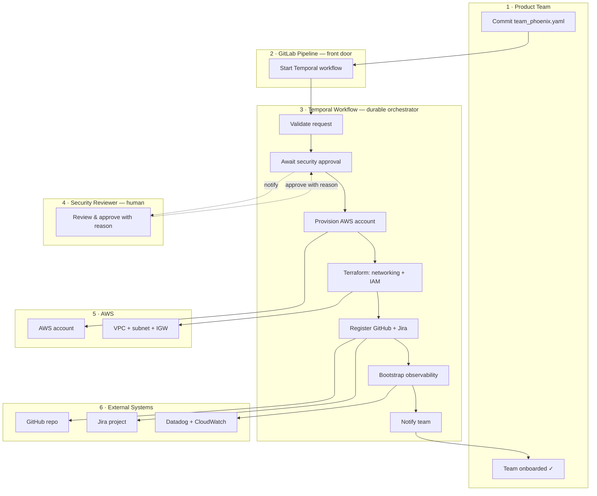

# After — with Temporal

**Audience:** customer, not deep on Temporal concepts.
**Scope:** happy path only. Compensation flow on failure is captured separately.

```mermaid
flowchart TB
    subgraph PT["1 · Product Team"]
        direction LR
        PT1[Commit team_phoenix.yaml]
        PT2[Team onboarded ✓]
    end

    subgraph GL["2 · GitLab Pipeline — front door"]
        direction LR
        GL1[Start Temporal workflow]
    end

    subgraph TW["3 · Temporal Workflow — durable orchestrator"]
        direction LR
        TW1[Validate request] --> TW2[Await security approval]
        TW2 --> TW3[Provision AWS account]
        TW3 --> TW4[Terraform: networking + IAM]
        TW4 --> TW5[Register GitHub + Jira]
        TW5 --> TW6[Bootstrap observability]
        TW6 --> TW7[Notify team]
    end

    subgraph SR["4 · Security Reviewer — human"]
        direction LR
        SR1[Review & approve with reason]
    end

    subgraph AWS["5 · AWS"]
        direction LR
        A1[AWS account]
        A2[VPC + subnet + IGW]
    end

    subgraph EXT["6 · External Systems"]
        direction LR
        E1[GitHub repo]
        E2[Jira project]
        E3[Datadog + CloudWatch]
    end

    PT1 --> GL1 --> TW1
    TW2 -. "notify" .-> SR1
    SR1 -. "approve with reason" .-> TW2
    TW3 --> A1
    TW4 --> A2
    TW5 --> E1
    TW5 --> E2
    TW6 --> E3
    TW7 --> PT2
```
