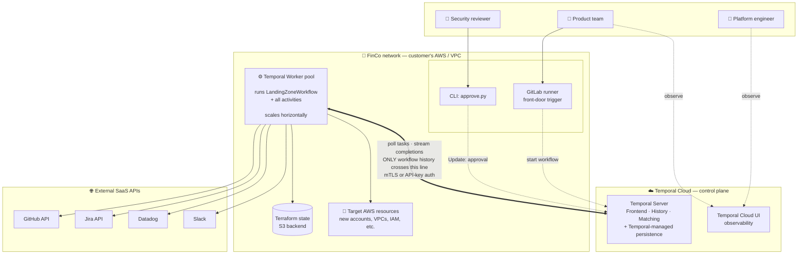

# Architecture — runtime topology with trust boundaries

**Audience:** customer, not deep on Temporal concepts.
**Scope:** deployment-level view using Temporal Cloud. Three trust boundaries: customer's network, Temporal Cloud (control plane), and external SaaS systems. Emphasizes *where things run* and *what crosses boundaries*.

## Key architectural points this diagram makes

1. **Workers live in the customer's network.** All code touching AWS, Terraform state, and external APIs runs inside FinCo's infrastructure. Temporal Cloud never reaches into the customer network.
2. **Only workflow history crosses to Temporal Cloud.** Activity inputs/outputs are part of that history (encrypted in transit), but there's no separate data-plane that sees business data.
3. **Workers scale horizontally.** Temporal Server assigns tasks; any available worker picks them up. Run 1 worker or 50.
4. **Temporal Cloud UI is the observability surface.** Platform engineers and product teams observe live workflows here — no custom dashboards required.
5. **GitLab runner and CLI are just Temporal *clients*.** They call the gRPC API to start workflows and send Updates. They're small pieces of glue.
