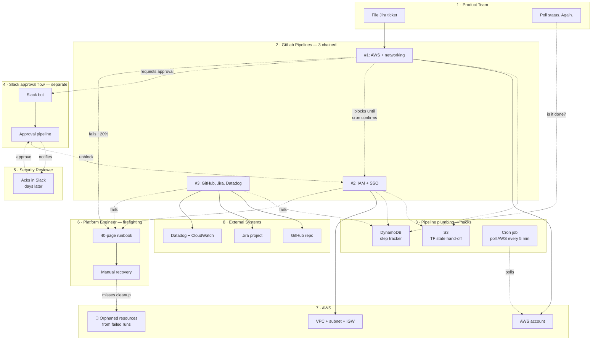

# Before — the current state

**Audience:** customer, not deep on Temporal concepts.
**Scope:** FinCo's regulated-team onboarding as it exists today — a patchwork of pipelines, external state stores, cron pollers, Slack-driven approvals, and platform-engineer firefighting. The visual density *is* the pain.

